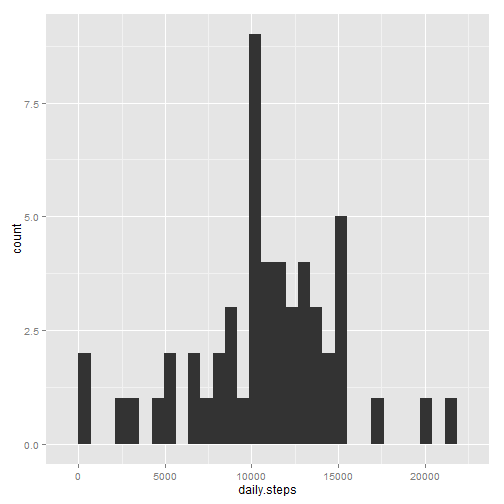
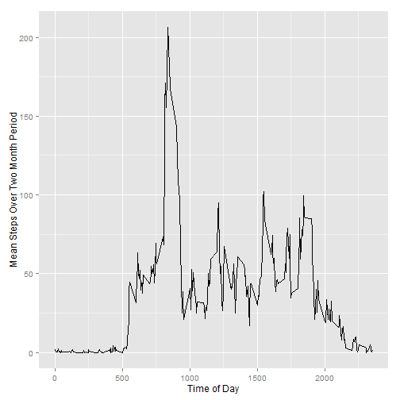
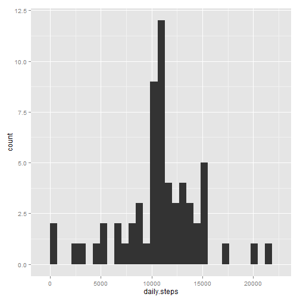
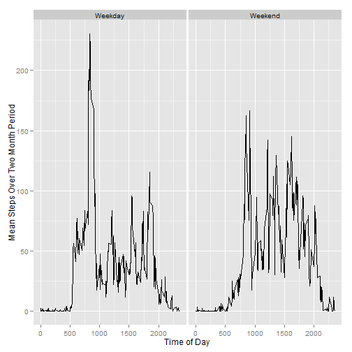

Loading and preprocessing the data
----------------------------------

First I download the data into our working directory, load it into R and then change the format of the "date" column from a factor to a date so that it will be more easily analyzable. Per the instructions, I ignore missing values in the datasets by only reviewing rows for which there are recorded values. I then summarize the data for the total number of steps for each day.


```r
##download and unzip data
url<-"https://d396qusza40orc.cloudfront.net/repdata%2Fdata%2Factivity.zip"
if(!file.exists("amd.zip")){
                download.file(url, "amd.zip")
                unzip("amd.zip", exdir = "amd")}
data<-read.csv("amd/activity.csv")
##change format of date column
data$date<-as.Date(data$date)
##subset data for complete cases only (ignoring NAs)
data2<-data[complete.cases(data),]
##create a summary data frame that aggregates data by the total steps for each day
library(plyr)
data3<-ddply(data2, "date", summarise,
             daily.steps = sum(steps))
```

What is the mean total number of steps taken per day?
----------------------
First, we will create a histogram of the total number of steps taken each day. The histogram shows that on most days, the walker makes between roughly 6000 and 16000 steps.


```r
library(ggplot2)
qplot(data = data3, daily.steps)
```

```
## stat_bin: binwidth defaulted to range/30. Use 'binwidth = x' to adjust this.
```

 

Second, we calculate and report the mean and median total number of steps taken per day. The mean is 10766 and the median is 10765, which is nearly identical.


```r
mean(data3$daily.steps)
```

```
## [1] 10766.19
```

```r
median(data3$daily.steps)
```

```
## [1] 10765
```

What is the average daily activity pattern?
--------------------
First, I create a line graph of the mean number of steps for each 5 minute interval during the day. As the graph shows, the walker is dormant during the early morning (probably indicating sleep) and then becomes quite active at around 800 hours. Walking activity then fluctuates during the daytime and then tapers off during the late evening (2100 hours).


```r
data4<-ddply(data2, "interval", summarise, mean.steps = mean(steps))
qplot(data = data4,
      x = interval,
      y = mean.steps,
      geom = "line",
      xlab = "Time of Day",
      ylab = "Mean Steps Over Two Month Period")
```

 

The most active interval during the day is at 8:35 am, where there is a mean of 206 steps taken during the five-minute interval.


```r
data5<-arrange(data4, -mean.steps)
data5[1,]
```

```
##   interval mean.steps
## 1      835   206.1698
```

Imputing missing values
-----------------------

I first count the total number of rows in the original dataset where there are complete cases. This calculation shows their are 2304 rows with missing values (indicated by a "NA") and 15264 rows with complete values.


```r
table(complete.cases(data))
```

```
## 
## FALSE  TRUE 
##  2304 15264
```

I then impute the missing values by replacing them with the mean steps per interval for that interval. 


```r
## join original dataset (includes NA values) with new column on the mean steps per interval
data6<-merge(data, data4)

## go through each row in dataset. If the "steps" column contains a NA,
## then reassign that value with the mean steps per interval 
## for that interval
for (i in 1:nrow(data6)){
  if (is.na(data6[i,2]) == TRUE){
    data6[i,2]<-data6[i,4]
  }
}
```

I create a histogram of the sums of daily steps of the new dataset with the imputed missing values as well as calculate the mean (10766) and median (also 10766). The mean of the dataset with the imputed null values is nearly identical to the mean of the dataset that excluded the null values. The median of the dataset with the imputed null values is slightly greater than the median of the dataset that excluded the null values.


```r
data7<-ddply(data6, "date", summarise,
             daily.steps = sum(steps))
qplot(data = data7, daily.steps)
```

```
## stat_bin: binwidth defaulted to range/30. Use 'binwidth = x' to adjust this.
```

 

```r
mean(data7$daily.steps)
```

```
## [1] 10766.19
```

```r
median(data7$daily.steps)
```

```
## [1] 10766.19
```

Are there differences in activity patterns between weekdays and weekends?
------------------------------------------

I created a panel, time-series plot showing average daily step activity for weekdays versus weekends. As the plots how, there is a larger morning spike in walking activity during the weekdays versus the weekends. But throughout the day and into the evening, there is generally more walking activity during the weekend then during the weekday.


```r
##create logical vector on whether date is a weekend (TRUE) or a weekday (FALSE)
library(chron)
weekendlogic<-is.weekend(data6$date)
##create more descriptive names instead of logical operators
weekend<-mapvalues(weekendlogic, 
                   from = c("FALSE","TRUE"), 
                   to = c("Weekday","Weekend"))
##add column to dataset
data8<-cbind(data6, weekend)
##summarize means by interval and weekend/weekday 
data9<-ddply(data8, c("interval","weekend"), summarize, mean.steps.detail = mean(steps))
##create panel time series plot
qplot(data = data9,
      x = interval,
      y = mean.steps.detail,
      facets = .~weekend,
      geom = "line",
      xlab = "Time of Day",
      ylab = "Mean Steps Over Two Month Period")
```

 
